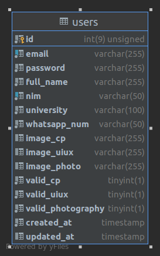
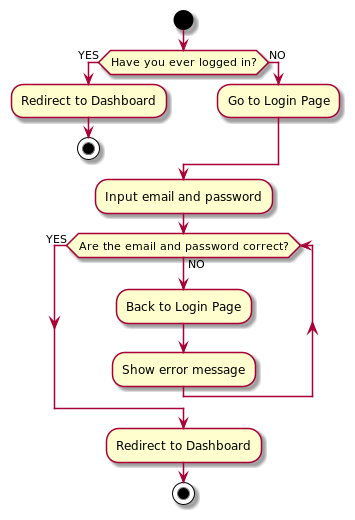

# Srifoton 2021

A repository that contain Srifoton 2021 Web project and documentation. For UI code, we separate on different
repositories.

See the following repositories [Srifoton UI](https://github.com/Srifoton-IT-Team/srifoton-ui-2021) here.

### Index

- [How To Run Development](#how-to-run-how-to-run-development)
- [SiteMap](#sitemap)
- [Documentation](#documentation)
    - [Environment](#environment)
    - [Database](#database)

## How to Run Development

1. PHP version 7.3 or newer is required.

```
$ php -v
```

2. Install latest version of MySQL.
3. Clone this repo.

```
$ git clone https://github.com/Srifoton-IT-Team/srifoton-2021.git
```

4. Uncomment intl extension in php.ini

```ini
;extension=intl
;to
extension = intl
```

5. Install latest version of Composer.
6. Install dependencies.

```
$ composer update
```

7. Run local development server.

```
$ php spark serve
```

Open http://localhost:8080 to view it in the browser.

Note : In order to have the same database and table structure, please read about [Migration](#migration) here.

## SiteMap

- GET / , for Landing page.
- GET /login, for Login Account.
- GET /register, for Register Account.
- POST /register/save, for submit data.
- GET /dashboard, for Dashboard Account.
- GET /competitive-programming, for CP competition.
- GET /ui-ux-design, for UI/UX competition.
- GET /photography, for Photography competition.

# Documentation

## Environment

If you want to change base setting for project like database password, go to .env file.

## Database

### Schema



### Migration

Database Migration is a way to automatically create tables according to what has been determined, this makes it easier
for us to have the same table structure.

Note : Before running the migration, make sure the database has been created. If not, run the following code :

```
$ php spark db:create srifoton_2021
```

<br>

Here's how to run the migration :

```
$ php spark migrate
```

If the migration doesn't work, drop table migrations in your database.

If the table already exists, and want to update it, do the following :

```
$ php spark migrate:refresh
```

## Accounts

### Login


We use session to remember whether the user has logged in or not.